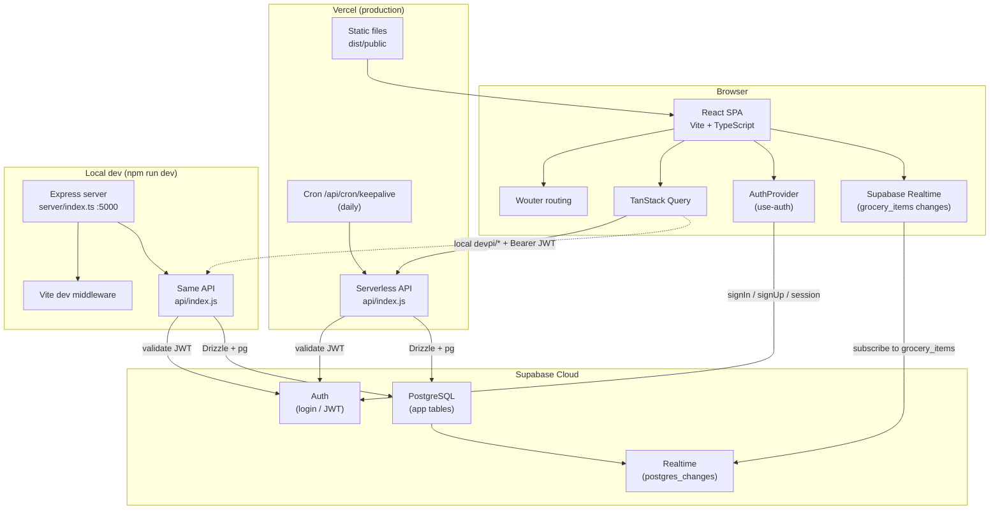
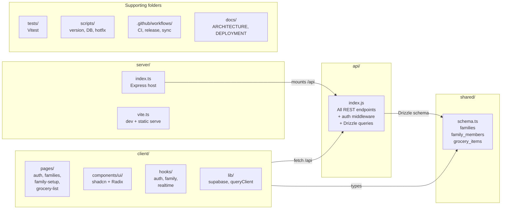
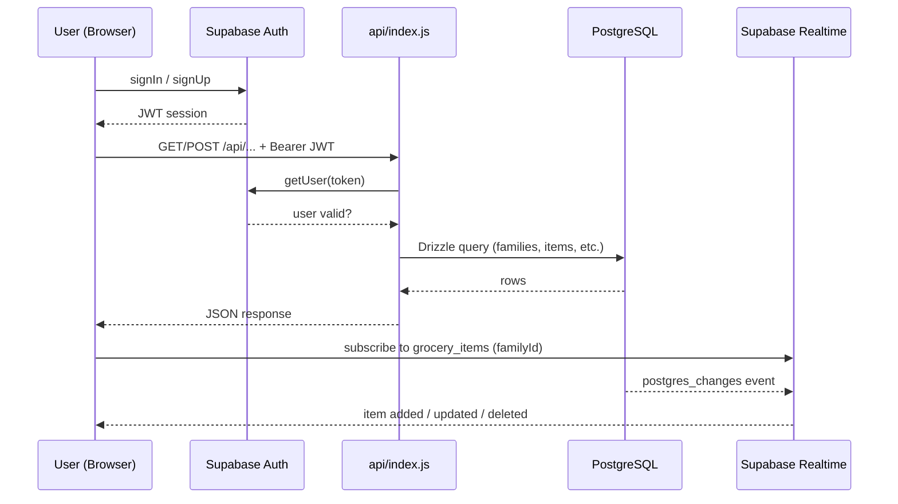
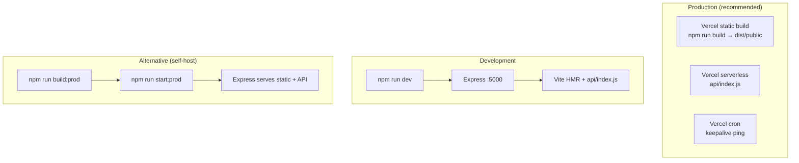
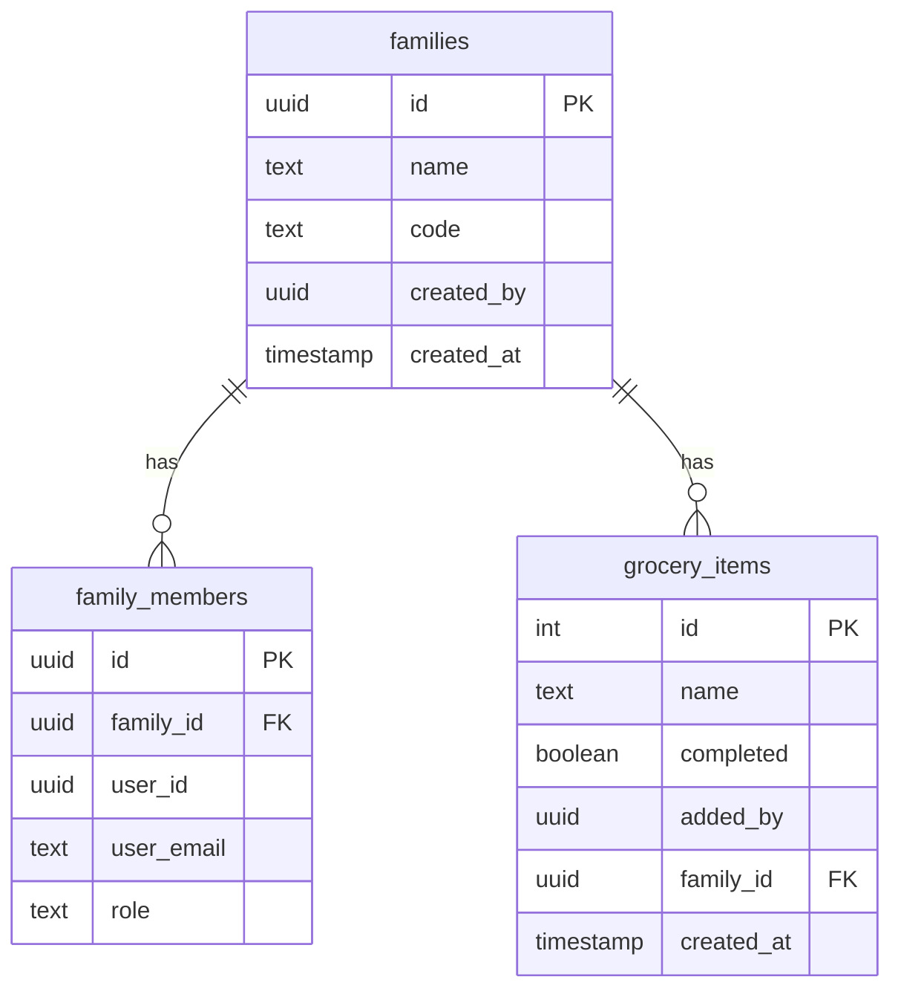
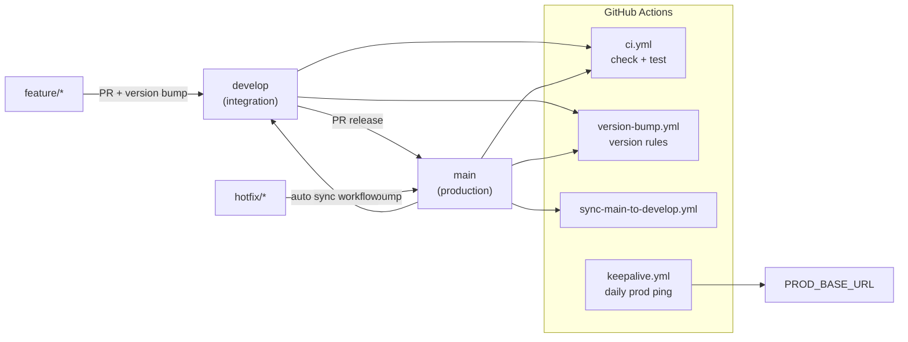

# Architecture

Technical overview of the Family Grocery Shopping App: how the repo is organized, what runs where, and how data flows through the system.

For deployment and environment setup, see [DEPLOYMENT.md](./DEPLOYMENT.md) and [DATABASE_SETUP.md](./DATABASE_SETUP.md).

---

## Quick mental model

1. The **browser** uses **Supabase Auth** for login and **Supabase Realtime** for live grocery list updates.
2. The **browser** calls **`/api/*`** for all CRUD (families, members, grocery items).
3. **`api/index.js`** validates JWTs via Supabase and reads/writes PostgreSQL via Drizzle.
4. **Vercel** serves the built React app and the same API in production.
5. **Express** is the local dev (and optional self-host) wrapper around that same API.

---

## 1. Runtime architecture

One API implementation (`api/index.js`) is shared everywhere. Vercel runs it as serverless; locally, Express mounts it at `/api`.



---

## 2. Repository layout



### Folder reference

| Path | Purpose |
|------|---------|
| `client/` | React SPA — pages, components, hooks, Supabase client |
| `api/` | Central API router used by both Vercel and Express |
| `server/` | Express host for local dev and optional self-hosted production |
| `shared/` | Drizzle schema and Zod validation types shared across client and API |
| `scripts/` | Build, version checks, DB utilities, hotfix helpers |
| `tests/` | Vitest unit and integration tests |
| `docs/` | Architecture, deployment, and database documentation |
| `.github/workflows/` | CI, version checks, main→develop sync, keepalive cron |

---

## 3. Tech stack by layer

| Layer | Technology | Location |
|-------|------------|----------|
| **UI** | React 18, TypeScript, Tailwind, shadcn/ui, Radix | `client/` |
| **Routing** | Wouter | `client/src/App.tsx` |
| **Client state** | TanStack Query | `client/src/lib/queryClient.ts` |
| **Auth (client)** | Supabase JS SDK | `client/src/lib/supabase.ts` |
| **Live updates** | Supabase Realtime (`postgres_changes`) | `client/src/hooks/use-websocket.ts` |
| **API** | Single JavaScript handler | `api/index.js` |
| **Local server** | Express + Vite middleware | `server/index.ts` |
| **Production host** | Vercel static build + serverless Node | `vercel.json` |
| **ORM / validation** | Drizzle + Zod | `shared/schema.ts`, `api/index.js` |
| **Database** | PostgreSQL (Supabase-hosted) | via `DATABASE_URL` |
| **Auth (server)** | Supabase `getUser(token)` | `api/index.js` |
| **Build** | Vite (client), esbuild (server bundle) | `vite.config.ts`, `scripts/build-server.mjs` |
| **Tests** | Vitest + Testing Library | `tests/` |
| **CI/CD** | GitHub Actions | `.github/workflows/` |

---

## 4. Auth and data flow



### Auth details

1. **Client** — `AuthProvider` in `client/src/hooks/use-auth.tsx` handles sign-up, sign-in, sign-out, and session state via the Supabase client.
2. **API calls** — TanStack Query attaches the Supabase access token as `Authorization: Bearer …` on every request.
3. **Server validation** — `authenticateUser()` in `api/index.js` calls `supabase.auth.getUser(token)` using `SUPABASE_URL` and `SUPABASE_ANON_KEY`.
4. **Account deletion** — optional `SUPABASE_SERVICE_ROLE_KEY` enables `auth.admin.deleteUser`.
5. **User IDs** — stored as UUIDs referencing Supabase `auth.users` (`created_by`, `user_id`, `added_by` in `shared/schema.ts`).

---

## 5. Deployment modes



### How each mode serves the API

| Mode | Entry | API served by |
|------|-------|---------------|
| **Local dev** | `npm run dev` → `server/index.ts` | Express mounts `expressMiddleware` from `api/index.js` at `/api` |
| **Self-hosted prod** | `npm run build` + `npm start` | Express serves `dist/public` and the bundled server |
| **Vercel (recommended)** | `vercel.json` | Static SPA from `dist/public`; `/api/*` routed to `api/index.js` via `@vercel/node` |

Key config files:

| File | Purpose |
|------|---------|
| `vite.config.ts` | React plugin, path aliases, build to `dist/public`, injects app version |
| `vercel.json` | Static build + Node API routing + SPA fallback + daily keepalive cron |
| `drizzle.config.ts` | Drizzle Kit schema push config |
| `.env.example` | Required env vars: `DATABASE_URL`, Supabase keys, optional `ALLOWED_ORIGINS` |

---

## 6. Database model

Schema is defined in `shared/schema.ts`. Changes are applied with `npm run db:push` (Drizzle Kit), not migration files.



### Runtime database connection

- **Active path** — `pg.Client` + `drizzle-orm/node-postgres` in `api/index.js`
- **Schema push** — `drizzle.config.ts` reads `DATABASE_URL` and targets `./shared/schema.ts`
- **Hosting** — PostgreSQL via Supabase (or Neon-compatible connection string)

---

## 7. External services

| Service | Role | Where used |
|---------|------|------------|
| **Supabase Auth** | Login, signup, JWT validation | `client/src/lib/supabase.ts`, `api/index.js` |
| **Supabase Realtime** | Live grocery list updates on `grocery_items` | `client/src/hooks/use-websocket.ts` |
| **Supabase Postgres** | Application data | `DATABASE_URL` in API layer |
| **Vercel** | Static hosting, serverless API, cron | `vercel.json` |
| **GitHub Actions** | CI, version gates, branch sync, keepalive | `.github/workflows/` |

### Keepalive

Supabase free-tier projects can pause after inactivity. Two mechanisms prevent that:

- **Vercel cron** — hits `/api/cron/keepalive` daily (`vercel.json`)
- **GitHub Actions** — `.github/workflows/keepalive.yml` pings `PROD_BASE_URL/api/cron/keepalive`

---

## 8. Git workflow and CI/CD



### Workflows

| Workflow | Trigger | What it does |
|----------|---------|--------------|
| `ci.yml` | PRs to `develop`/`main`, push to `develop` | `npm run check` + `npm test` |
| `version-bump.yml` | PRs to `develop`/`main` | Enforces version bump rules via `scripts/check-version-bump.mjs` |
| `sync-main-to-develop.yml` | Push to `main` | Merges `main` back into `develop` (direct push or auto-PR) |
| `keepalive.yml` | Daily cron | Pings production keepalive endpoint |

### Versioning

App version follows `MAJOR.RELEASE.UPDATE` in root `package.json`. The UI displays it on the families page via `__APP_VERSION__` injected at build time by Vite.

---

## 9. Frontend routes

| Route | Page | Purpose |
|-------|------|---------|
| `/auth` | `auth.tsx` | Sign in / sign up |
| `/family-setup` | `family-setup.tsx` | Create or join a family |
| `/families` | `families-overview.tsx` | List and switch families |
| `/family-management` | `family-management.tsx` | Manage members and settings |
| `/` | redirect | Routes to `/families` or `/family-setup` based on family status |
| Grocery list | `grocery-list.tsx` | Shared grocery list for the active family |

Routing is defined in `client/src/App.tsx` using Wouter.

---

## 10. API surface

All endpoints live in `api/index.js`. The Express adapter (`expressMiddleware`) and Vercel handler (`export default handler`) both delegate to the same route logic.

Representative endpoints:

| Method | Path | Purpose |
|--------|------|---------|
| GET | `/api/ping` | Health check |
| GET | `/api/families` | List user's families |
| POST | `/api/families` | Create a family |
| POST | `/api/families/join` | Join by 6-digit code |
| GET | `/api/families/:id/grocery-items` | List items for a family |
| POST | `/api/grocery-items` | Add an item |
| PATCH | `/api/grocery-items/:id` | Update an item |
| DELETE | `/api/grocery-items/:id` | Delete an item |
| GET | `/api/cron/keepalive` | Database keepalive (cron only) |

All authenticated routes require a valid Supabase JWT in the `Authorization` header.

---

## 11. Testing

- **Runner** — Vitest (`vitest.config.ts`)
- **Environment** — jsdom with `@testing-library/react`
- **Setup** — `tests/setup.ts`

Test coverage includes API route logic (mocked Supabase/pg/Drizzle), React components, version bump scripts, and server utilities.

Run tests with:

```bash
npm test
```

---

## 12. Key config and env vars

```env
# Database
DATABASE_URL=postgresql://...

# Supabase (server)
SUPABASE_URL=https://...
SUPABASE_ANON_KEY=...
SUPABASE_SERVICE_ROLE_KEY=...   # optional, for account deletion

# Supabase (client — Vite prefix required)
VITE_SUPABASE_URL=https://...
VITE_SUPABASE_ANON_KEY=...

# Production CORS
ALLOWED_ORIGINS=https://your-app.vercel.app

# Server
PORT=5000
NODE_ENV=development
```

See `.env.example` for the full list.

---

## Related documentation

- [DEPLOYMENT.md](./DEPLOYMENT.md) — Vercel deployment and environment setup
- [DATABASE_SETUP.md](./DATABASE_SETUP.md) — PostgreSQL and Supabase configuration
- [README.md](../README.md) — Getting started, scripts, and branch flow
